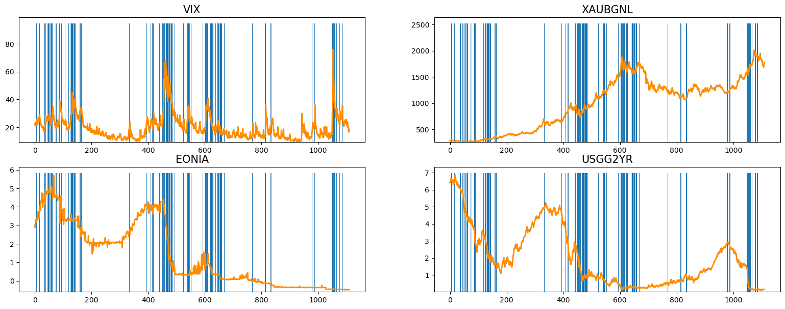
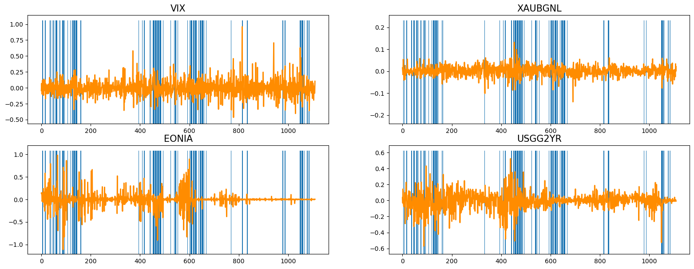
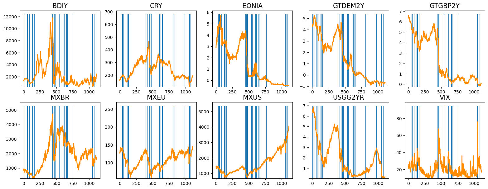
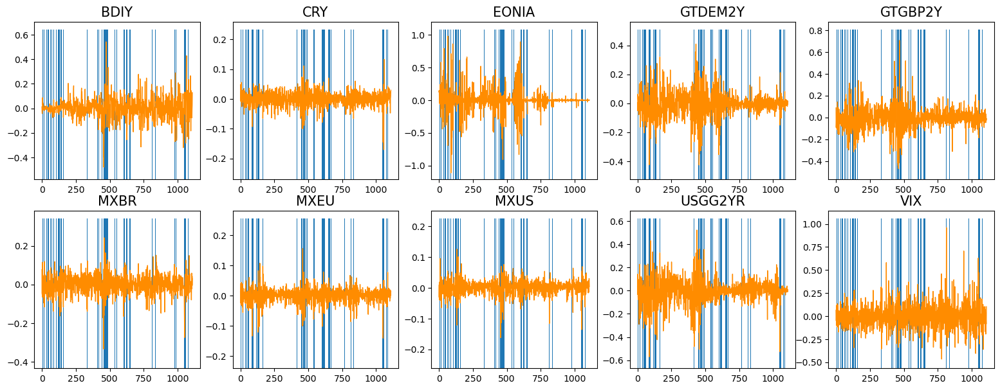

# Authors:
* [Raffaella D'Anna](https://www.linkedin.com/in/raffaella-d-anna-b779501a6/)
* [Alessandro Del Vitto](https://github.com/AlessandroDelVitto)
* [Michele Di Sabato](https://www.linkedin.com/in/michele-di-sabato/)
* [Rita Numeroli]()
* [Andrea Puricelli](https://www.linkedin.com/in/andrea-puricelli-/)

# Detecting Abnormal Markets - Early Warning Systems

## :clipboard: Framework:
To improve financial performance and prevent risks, it is important to detect anomalous behavior in the Financial Markets,
which have a tendency to crash.
* During normal periods or **risk-on** periods, investors have a high-risk appetite and bid up the prices of risky assets in the
market
* During a crisis, or **risk-off** periods, risk premia and financial assets exhibit anomalous behavior; investors become more
risk-averse and sell risky assets, sending their prices lower, and tend to gravitate toward lower-risk investments.

In this project we use [copulas](https://arxiv.org/abs/2009.09463) and k-NN coupled with over-sampling techniques (Naive random oversampling, [SMOTE](https://imbalanced-learn.org/stable/references/generated/imblearn.over_sampling.SMOTE.html), [BorderlineSMOTE](https://imbalanced-learn.org/stable/references/generated/imblearn.over_sampling.BorderlineSMOTE.html), [ADASYN](https://imbalanced-learn.org/stable/references/generated/imblearn.over_sampling.ADASYN.html) and [Naive random over-sampling](https://imbalanced-learn.org/stable/references/generated/imblearn.over_sampling.RandomOverSampler.html)) applied to some financial indices, with the goal of classifying a week as a risk-on week (nromal week) or risk-off week (anomaly).

Feel free to visit [this link](report_slides.pdf) for more details.

The dataset is composed of 42 time series, corresponsing to the time evolution of 42 indices from [Bloomberg](https://www.bloomberg.com/europe):

The vertical blue lines correspond to risk-off (anomalous) weeks, while the white regions are risk-on (normal) periods. 

To improve the classification performance and to apply "static" statistical analysis (such as statistical tests), we transformed the data to achieve stationarity, passing to the logarithm (for non negative indices) or to finite differences. For example, the previous four indices become:

We used augmented Dickey Fuller test to check whether stationarity has been reached.

Many features are correlated, some have low variance with repect to the others and some indices will not help to predict anomalies according to a financial perspective. For these reasons, we used Kolmogorov Smirnov test to remove useless indices (i.e. indices which have the same distribution under risk-on and risk-off perdiods)and the remaining indices were further reduced according to correlation and financial meaning.

After an extensive feature selection, we end up with 10 indices:

<!--  -->

We then moved to choosing a suitable model for the classification task. We decided to rely on the recall as optimizing metric, since correctly pointing out an anomaly is more imprortant than falsly classifying a week as a risk-off week.

t-Copulas seemed to be the best offer for our task, since the dataset is highly imbalanced toward the normal data points (i.e. there are much more white regions with respect to blu ones). We found out that t-copulas had a tendency of classifying too many points as anomalies, so we decided to attach a "confidence level" to the anomalies predicted by the copula. The higher the confidence level, the higher the probability of the copula's prediction to be correct. To get this confidence level, we over-sampled the dataset and applied k-NN on each instance in our augmented dataset to produce a probability measure of that point belonging to one of the two classes. The probability is computed as the frequency of k nearest points which belong to one of the two classes. We then attached this "confidence measure" to the copula's predictions. Parameter k has been tuned using Cross Validation.

Results are shown in [here](python/AnomalyDetection.ipynb), [here](matlab/AnomalyDetection.m) and [here](report_slides.pdf).