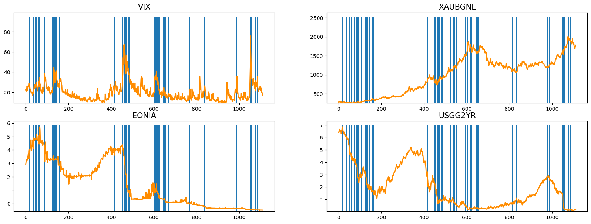
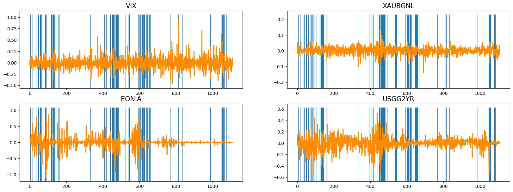

# Authors:
* [Raffaella D'Anna](https://www.linkedin.com/in/raffaella-d-anna-b779501a6/)
* [Alessandro Del Vitto](https://github.com/AlessandroDelVitto)
* [Michele Di Sabato](https://www.linkedin.com/in/michele-di-sabato/)
* [Rita Numeroli]()
* [Andrea Puricelli](https://www.linkedin.com/in/andrea-puricelli-/)

# Detecting Abnormal Markets - Early Warning Systems

To improve financial performance and prevent risks, it is important to detect anomalous behavior in the Financial Markets,
which have a tendency to crash.
* During normal periods or **risk-on** periods, investors have a high-risk appetite and bid up the prices of risky assets in the
market
* During a crisis, or **risk-off** periods, risk premia and financial assets exhibit anomalous behavior; investors become more
risk-averse and sell risky assets, sending their prices lower, and tend to gravitate toward lower-risk investments.

In this project we use [copulas](https://arxiv.org/abs/2009.09463) and k-NN coupled with over-sampling techniques (Naive random oversampling, [SMOTE](https://imbalanced-learn.org/stable/references/generated/imblearn.over_sampling.SMOTE.html), [BorderlineSMOTE](https://imbalanced-learn.org/stable/references/generated/imblearn.over_sampling.BorderlineSMOTE.html), [ADASYN](https://imbalanced-learn.org/stable/references/generated/imblearn.over_sampling.ADASYN.html) and [Naive random over-sampling](https://imbalanced-learn.org/stable/references/generated/imblearn.over_sampling.RandomOverSampler.html)) applied to some financial indices, with the goal of classifying a week as a risk-on week (nromal week) or risk-off week (anomaly).

Feel free to visit [this link](https://github.com/MicheleDiSabato/detecting-abnormal-markets-ews/blob/main/report_slides.pdf) for more details.

The dataset is composed of 42 time series, corresponsing to the time evolution of 42 indices from [Bloomberg](https://www.bloomberg.com/europe):

The vertical blue lines correspond to risk-off (anomalous) weeks, while the white regions are risk-on (normal) periods. 

To improve the classification performance, we transformed the data to make it stationary, passing to the logarithm (for non negative indices) or to finite differences. For example, the previous four indices become:

We used augmented Dickey Fuller test to check whether stationarity has been reached.

Many features are correlated, some have low variance with repect to the others and some indices will not help to predict anomalies according to a financial perspective. For these reasons, we used Kolmogorov Smirnov test to remove useless indices, i.e. indices which have the same distribution under risk-on and risk-off perdiods.

After an intensive feature selection, we end up with:

